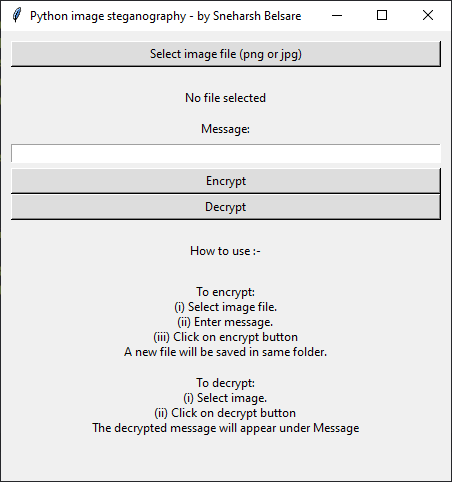

# Python-GUI-image-steganography
GUI app for image steganography in python

## Features
* Encrypt a message in any png or jpg image file.
* Decrypt the message from a png or jpg image file.

## Running locallly
* clone the repo.
* _(Optional):_ Create a virtual environment using `venv`.
* Install requirements using pip: `pip install -r requirements.txt` (Note: if pip doesn't work, try `pip3` instead)
* Run the script ! `python3 main.py` (Note: if `python3` doesn't work, try `py` or `py -3` or simply `python` instead) 
