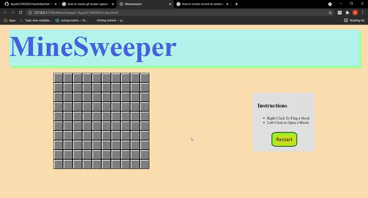
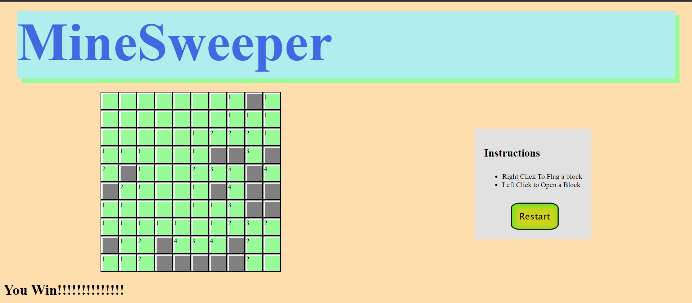
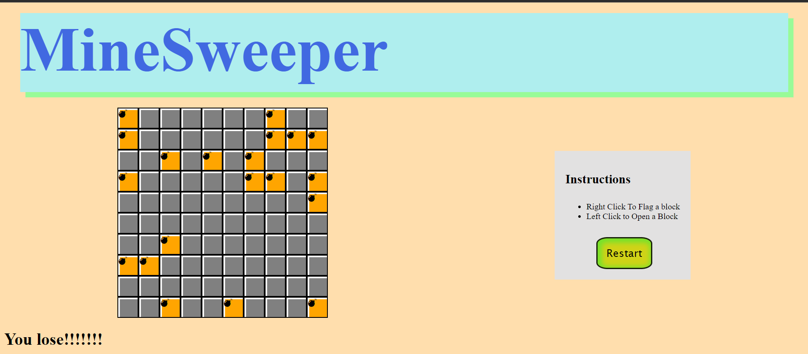

# MineSweeper

 

Minesweeper is a single-player puzzle video game. The objective of the game is to clear a rectangular board containing hidden "mines" or bombs without detonating any of them, with help from clues about the number of neighboring mines in each field.

## Rules

- Left Click any cell to reveal it.
- Clicking on a cell containing a mile will make you lose the game
- Every valid cell will show the number of bombs in 8 direction from the cell.
- You can use right click to flag a block so you do not left click on it by mistake.

## Examples

 

   
<h3>
    All info and resources cited from <a href="https://en.wikipedia.org/wiki/Minesweeper_(video_game)">Wikipedia</a>
</h3>
 

### Author name: [Ayush Kumar](https://github.com/Ayush21042002)
