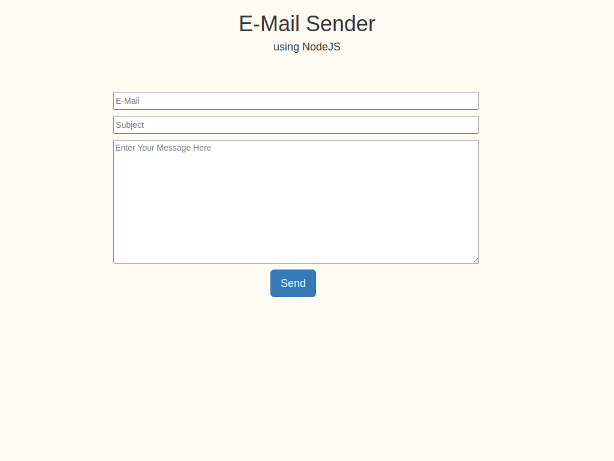
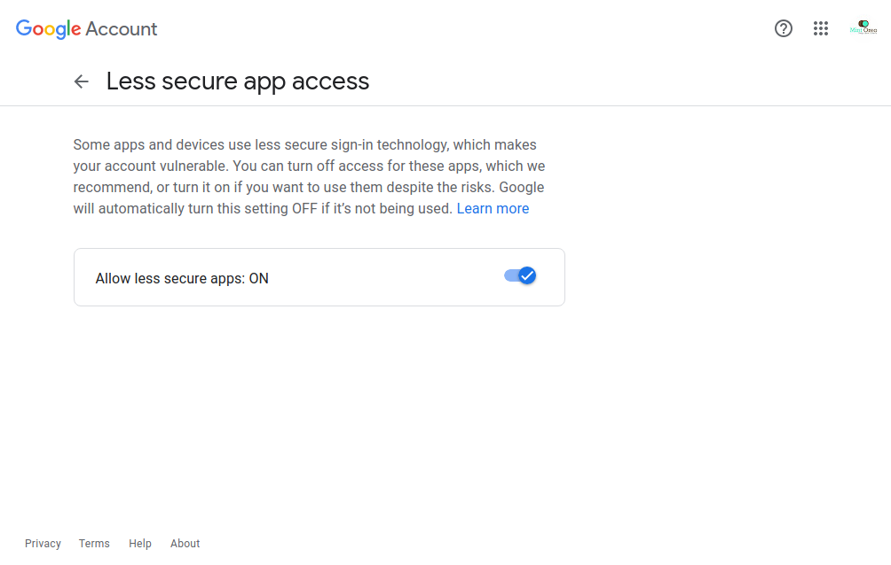

# E-Mail Sender
### A NodeJS App

<br>

## Important:

For Security Purposes, We could not provide email here. This is a tested app. In order to use it you need to 
REPLACE ``` user: 'yourMail@gmail.com', pass: 'YourREALPassword' ```  
in **app.js** file.

**Note: If You're using GMAIL, you will need to turn ON `LESS SECURE APPS` under settings. Google do not consider NodeJS module to be 'safe', so allow access to `LESS SECURE APPS` Like this ⬇️
<br>


#### How To Use It.
1. Fork into Repository & clone it using `git clone https://github.com/Harshal0902/Hacktoberfest.git`
2. Navigate to `email-sender` folder.
3. **Run this command `npm install`**
3. Replace "Your E-mail" & "Password" in `app.js` file as mentioned above.
4. Run command `node app.js`
5. Open web browser and goto `localhost:3000`
