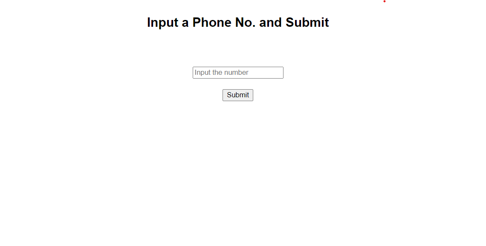
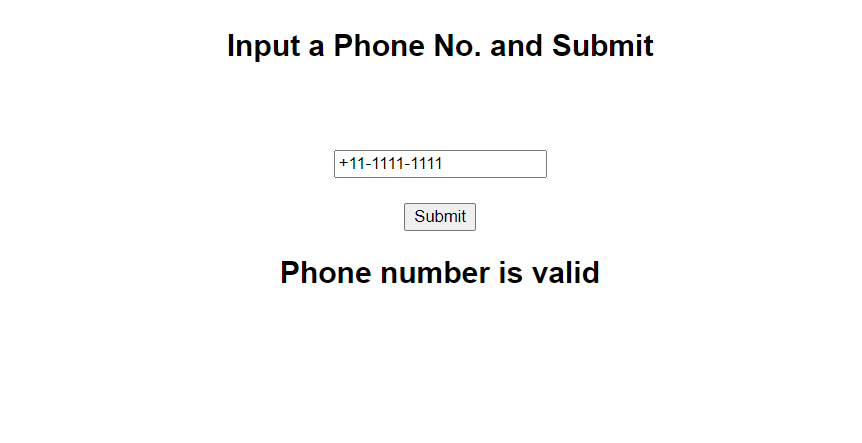

<h1 align="center">Phone Number Validator</h1>
<h2 align="center">
A Phone Number Validator to check whether the given phone number is in valid format or not
</h2>

### Supported Formats
<ul>
<li>+xx-xxxx-xxxx</li>
<li>+xx.xxxx.xxxx</li>
<li>+xx xxxx xxxx</li>
<li>xxxxxxxxxx</li>
</ul>

### Author
This code written by [Vedvardhan Gyanmote](https://www.github.com/ved08)
