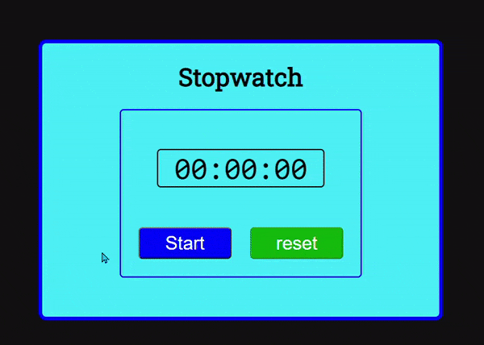

# STOPWATCH using ReactJS

This is a simple stopwatch built using ReactJS. You can start, pause(or stop), and reset the time.

    

## note

### if you'd like to edit the Component file, do the following step in the root folder

- Step 1: Run `npm init -y`
- Step 2: Run `npm install babel-cli@6 babel-preset-react-app@3`
- Step 3: run `npx babel --watch src --out-dir . --presets react-app/prod`
- step 4: you can edit the component in the 'src' folder

Don’t wait for it to finish, this command starts an automated watcher for JSX. let command run in the terminal, and you can start to edit the component

## Author

odorifqi
